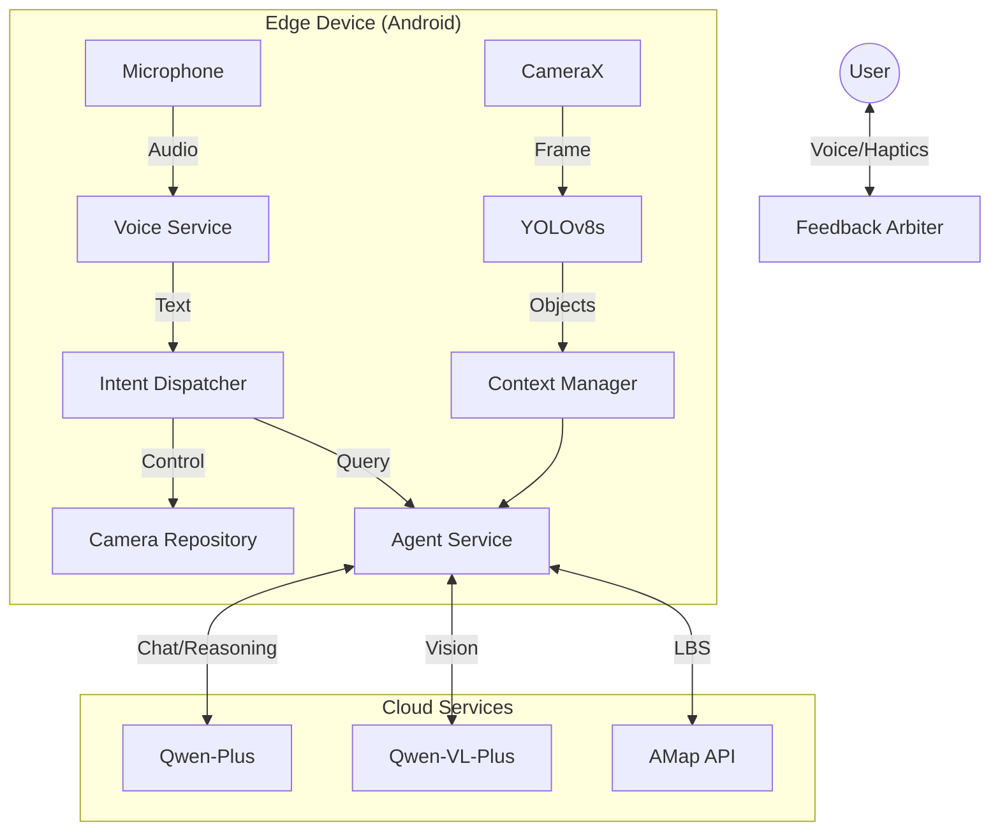

# Lumina: Intelligent Multimodal Agent for Visually Impaired
### 视障人群视觉辅助与避障导航智能体

> **Winner of the 19th National College Software Innovation Contest (Candidate)**

Lumina is not just an object detector; it is a **fully autonomous agent** designed to be the "digital eyes and brain" for visually impaired users. By combining edge-side real-time perception with cloud-side cognitive intelligence, Lumina provides a seamless, safe, and context-aware navigation experience.

---

## 🚀 Key Features

### ⚡ Hybrid Perception (端云协同感知)
- **Fast System (Edge)**: Powered by **YOLOv8s** running on ONNX Runtime. Provides millisecond-level detection for immediate obstacle avoidance (Cars, Pedestrians, Traffic Lights).
- **Slow System (Cloud)**: Powered by **Qwen-VL-Plus**. Provides deep semantic understanding of complex scenes (e.g., "Describe the street crossing situation").
- **Hybrid Prompting**: Edge detection results are injected into the Cloud VLM's prompt to enhance hallucination resistance and accuracy.

### 🧠 Cognitive Agent Brain (认知智能体)
- **Context Awareness**: Maintains a real-time `ContextSnapshot` of visual objects, location, time, and battery status.
- **Intent Dispatching**: Intelligently routes user voice commands to the appropriate handler (Camera Control, Navigation, or Chat).
- **Memory System**: Remembers past interactions and scene descriptions using a local vector/relational database.

### 📍 LBS Integration (高德地图 LBS)
- **Real-time Positioning**: Precise location tracking using AMap SDK.
- **POI Search**: "Is there a pharmacy nearby?" - Powered by AMap Web Services.
- **Walking Navigation**: Basic route planning capabilities.

### 🛡️ Safety-First Feedback Architecture
- **Feedback Arbiter**: A centralized priority queue for TTS and Haptics.
- **Critical Interrupts**: Safety warnings (e.g., "Car approaching!") immediately override casual conversation or status updates.
- **Semantic Haptics**: Distinct vibration patterns for different alert levels.

---

## 🏗️ Architecture



---

## 🛠️ Tech Stack

- **Language**: Kotlin
- **UI**: Jetpack Compose (Material3)
- **AI/ML**: 
  - ONNX Runtime (Edge Inference)
  - LangChain4j (Agent Orchestration)
  - Alibaba DashScope (Qwen LLM/VLM)
- **LBS**: AMap Location SDK & Web API
- **Architecture**: MVVM + Clean Architecture (Domain/Data/Presentation)

---

## 🏁 Getting Started

### Prerequisites
- Android Studio Koala or newer.
- Android Device (Min SDK 24, Target SDK 34).
- **API Keys**: You need keys for AMap (Gaode) and DashScope (Qwen).

### Configuration
Create a `local.properties` file in the root directory and add your keys:

```properties
sdk.dir=C\:\\Users\\YourName\\AppData\\Local\\Android\\Sdk

# AMap (Gaode Map) Keys
AMAP_ANDROID_KEY=your_amap_android_key_here
AMAP_WEB_KEY=your_amap_web_key_here

# Alibaba Cloud DashScope Key (for Qwen LLM/VLM)
DASHSCOPE_API_KEY=your_dashscope_key_here

# DeepSeek Key (Optional, if switching provider)
DEEPSEEK_API_KEY=your_deepseek_key_here
```

### Build & Run
1. Open project in Android Studio.
2. Sync Gradle.
3. Connect device via USB.
4. Run `app` configuration.

---

## 🤝 Contribution
This project is developed by the Lumina Team for the National College Software Innovation Contest.
- **Team Leader**: [Your Name]
- **Collaborators**: [Names]

## 📄 License
MIT License
